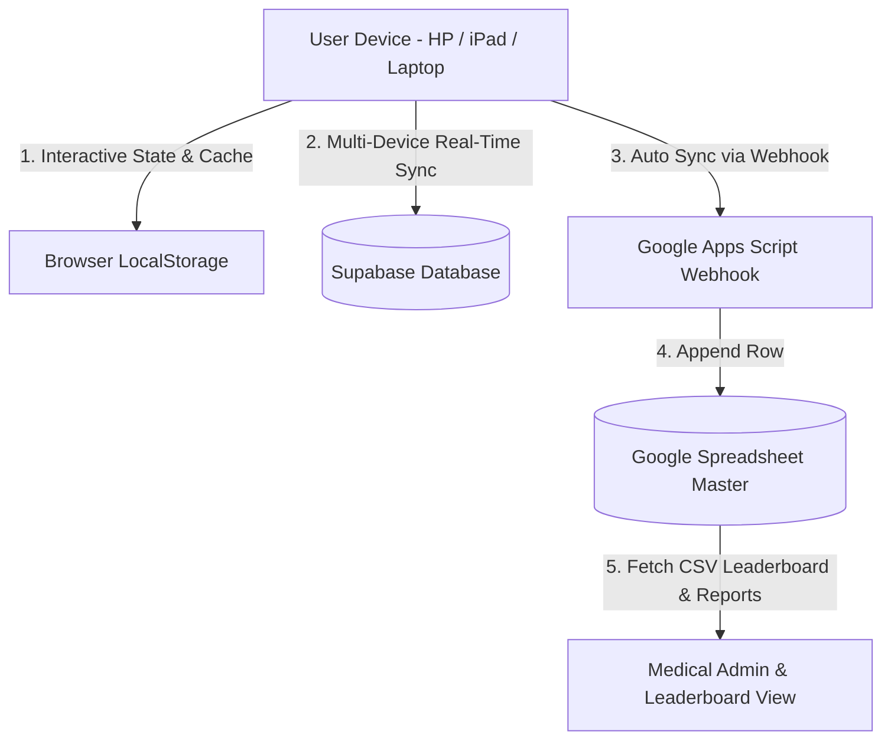

# Laporan Arsitektur Data & State Aplikasi Wellness Turbo Pertamina

**Dokumen Tanggal:** 7 Oktober 2026  
**Repository:** `kaylarmdn/wellnessturbo-pertamina`  
**Branch:** `main`  
**URL Live App:** [https://kaylarmdn-wellnessturbo-pertamina.wellnessturbo.workers.dev](https://kaylarmdn-wellnessturbo-pertamina.wellnessturbo.workers.dev)  
**Google Spreadsheet Master:** [Link Spreadsheet](https://docs.google.com/spreadsheets/d/1oXQ8Y2fTiXTIeaJid00gmF3l75lg_2S1HCfAKB5TcMk/edit)

---

## 1. Ringkasan Arsitektur Data (Overview)

Aplikasi **Wellness Turbo** menggunakan arsitektur **Multi-Tier Hybrid Storage** yang menggabungkan:
1. **Google Spreadsheet (Master Record & Leaderboard Source):** Menyimpan data master pengguna, leaderboard poin harian, kategori tantangan (NOVER, UNDER, BFA, Turbo Race), serta rekap Laporan Pembekalan.
2. **Supabase (Cloud Persistence & Cross-Device Sync):** Menyimpan data progres pembekalan (`pembekalan_progress`), tontonan video (`video_progress`), profil pengguna (`profiles`), timeline quiz, materi health talk, reward, dan klaim reward.
3. **Browser LocalStorage & Session (Offline-First State):** Menyimpan sesi login pengguna, cache progres pembekalan lokal, timeline quiz lokal, dan fallback reward jika offline.

---

## 2. Data di Browser LocalStorage (Data Lokal)

Berikut adalah seluruh key yang tersimpan di `localStorage` pada browser pengguna:

| Nama Key `localStorage` | Tipe Data | Fungsi & Deskripsi |
| :--- | :--- | :--- |
| `wt_current_user` | `JSON Object` | Profil akun peserta yang sedang aktif login (ID, Nama, Nopek/NIP, Lokasi, Fungsi, Jenis Kelamin). |
| `wt_admin_auth` | `Boolean String` (`"true"` / `"false"`) | Status autentikasi sesi Admin Medical / Super Admin. |
| `wt_spreadsheet_url` | `String URL` | URL Google Spreadsheet aktif (default: `https://docs.google.com/spreadsheets/d/1oXQ8Y2fTiXTIeaJid00gmF3l75lg_2S1HCfAKB5TcMk/edit`). |
| `wt_pembekalan_progress_v1` | `JSON Array` | Cache lokal progres pembekalan per user per modul (`user_id`, `module_id`, `video_progress_percentage`, `video_completed`, `quiz_completed`, `quiz_score`, `completed_at`). |
| `wt_video_progress_v1` | `JSON Array` | Log persentase durasi video yang disaksikan peserta per modul. |
| `wt_pembekalan_modules_v1` | `JSON Array` | Daftar modul pembekalan (Pembekalan 1: Ibu Meutia, Pembekalan 2: dr. Liona, Sp.GK, Pembekalan 3: dr. Nanang). |
| `wt_pembekalan_questions_v1` | `JSON Array` | Bank soal quiz pembekalan per modul. |
| `wt_quiz_timeline_v1` | `JSON Object` | Timeline tanggal mulai (`start_date`) & tanggal selesai (`end_date`) pengerjaan quiz per modul. |
| `wt_custom_categories` | `JSON Array` | Daftar kategori materi kustom yang ditambahkan Admin. |
| `wt_deleted_categories` | `JSON Array` | Daftar kategori materi yang disembunyikan/dihapus Admin. |
| `wt_rewards_v1` | `JSON Array` | Katalog penukaran reward (Poin, Kuota, Voucher, Merchandise). |
| `wt_claims_v1` | `JSON Array` | Histori klaim penukaran reward peserta. |
| `wt_challenge_events_v1` | `JSON Array` | Jadwal & status event tantangan olahraga/nutrisi. |
| `wt_user_feedback_v1` | `JSON Array` | Pesan & ulasan masukan peserta. |

---

## 3. Data di Google Spreadsheet (Master Sheet)

**Spreadsheet ID:** `1oXQ8Y2fTiXTIeaJid00gmF3l75lg_2S1HCfAKB5TcMk`  
**Koneksi Apps Script Webhook:** `https://script.google.com/macros/s/AKfycbxvfwHwQmGXjgh0y_RizyMwjEQAlKm1OnjxcFfapTWPxDJhEHZKpTbJcl75p__/exec`

### Tab / Sheet yang Terhubung:

1. **`USER` (Master Autentikasi & Profil)**
   - **Kolom Utama:** `Username` / `No. Pekerja`, `Password`, `Nama Pekerja`, `Lokasi`, `Fungsi`, `Jenis Kelamin`
   - **Fungsi:** Master data untuk login peserta dan pemetaan profil.

2. **`TURBO RACE` (Leaderboard Utama Poin Perorangan)**
   - **Kolom Utama:** `Nama Pekerja`, `No Pekerja`, `Fungsi`, `Lokasi`, `Poin`, `Jenis Kelamin`, `Rank`
   - **Fungsi:** Master data peringkat individu tertinggi.

3. **`POIN DAILY` (Leaderboard Konsistensi Harian)**
   - **Kolom Utama:** `Nama Pekerja`, `No Pekerja`, `Poin Daily`, `Lokasi`, `Fungsi`
   - **Fungsi:** Peringkat konsistensi akumulasi aktivitas harian.

4. **`POIN BFA` (Leaderboard Body Fat Analysis)**
   - **Kolom Utama:** `Nama Pekerja`, `No Pekerja`, `Poin BFA`, `Lokasi`, `Fungsi`
   - **Fungsi:** Master data poin pengukuran komposisi tubuh.

5. **`JENIS KELAMIN TURBO-NOVER` & `JENIS KELAMIN TURBO-UNDER`**
   - **Kolom Utama:** `Nama Pekerja`, `No Pekerja`, `Poin`, `Jenis Kelamin`
   - **Fungsi:** Peringkat peserta spesifik kategori Nover dan Under.

6. **`LAPORAN PEMBEKALAN` / `PEMBEKALAN` (Auto-Sync Hasil Pembekalan & Quiz)**
   - **Kolom Utama:** `Waktu Selesai`, `Nama Pekerja`, `No. Pekerja (Nopek)`, `Modul`, `Nilai Quiz`, `Status`
   - **Fungsi:** Rekap otomatis hasil penontonan video & penyelesaian quiz pembekalan dari peserta (dikirim via Webhook / 1-Klik Salin ke Sheet).

---

## 4. Data di Supabase Cloud Database

| Nama Tabel Supabase | Fungsi & Kolom Utama |
| :--- | :--- |
| `profiles` | Data profil akun (`id`, `employee_number`, `name`, `location`, `function`, `gender`). |
| `pembekalan_progress` | Progres pembekalan & quiz (`id`, `user_id`, `module_id`, `video_progress_percentage`, `video_completed`, `quiz_completed`, `quiz_score`, `completed_at`, `updated_at`). |
| `video_progress` | Log durasi tonton video (`id`, `user_id`, `health_talk_id`, `progress_percentage`, `completed`, `completed_at`). |
| `health_talks` | Daftar materi health talk & pembekalan (`id`, `title`, `description`, `video_url`, `category`). |
| `rewards` & `reward_claims` | Katalog & histori transaksi klaim reward peserta. |
| `feedback` | Masukan dan ulasan peserta. |

---

## 5. Logika State & Algoritma Utama Aplikasi

1. **Aturan Peringkat Leaderboard (Tie-Breaker Poin Sama):**
   - Jika dua peserta atau lebih memiliki jumlah poin yang sama, peserta yang **lebih dulu terinput di data Google Spreadsheet** (baris atas / `row_index` lebih kecil) akan menempati peringkat **lebih atas**.
   - Diimplementasikan di `sortLeaderboardRows` (`src/lib/types.ts`).

2. **Kanonikalisasi ID Modul Pembekalan (`normalizeModuleId`):**
   - Semua variasi ID modul (seperti `pem-1`, `pembekalan-1`, `modul-1`, `1`) otomatis dikanonkan menjadi `pem-1`, `pem-2`, `pem-3` untuk mencegah duplikasi progres.

3. **Multi-Tier Progress Merging (`listPembekalanProgress`):**
   - Progres pembekalan digabungkan secara cerdas dari 4 tier: `localStorage` ➔ Supabase `pembekalan_progress` ➔ Supabase `video_progress` ➔ Tab Google Spreadsheet `LAPORAN PEMBEKALAN`.
   - Menggunakan nilai tertinggi antara progres video (`Math.max`) dan nilai quiz terbaik.

4. **Multi-Device Lock & Sync:**
   - Progres disinkronkan ke Supabase & Google Spreadsheet secara real-time, sehingga jika peserta mengerjakan di HP, status tuntasnya langsung mengunci pilihan di iPad dan Laptop.

---
*Dokumen ini dibuat otomatis oleh Antigravity AI Assistant.*
